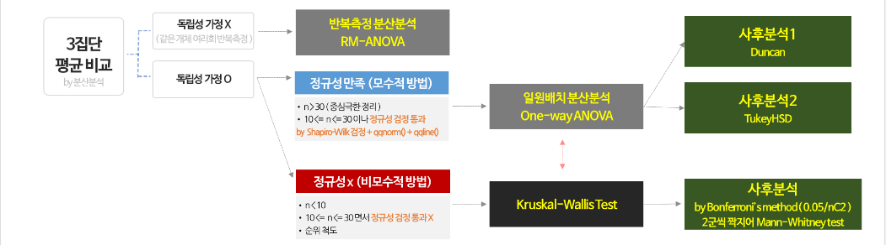

### **1. 네이버 영화 리뷰 크롤링**
***

#### 1.1 필요 패키지 설치 

```{r, eval=FALSE}
library(rJava) # rJava와 KoNLP는 다른 패키지보다 우선적으로 설치해주는 게 좋음
library(KoNLP)
library(lubridate)
library(stringr)
library(reshape2)
library(rvest)
library(dplyr)
library(xlsx)
library(ggplot2)
library(extrafont)
windowsFonts(dohyeon=windowsFont("BM DoHyeon"))
windowsFonts(jalnan=windowsFont("Jalnan"))

```

```{r, include=FALSE}
library(rJava) 
library(KoNLP)
library(lubridate)
library(stringr)
library(reshape2)
library(rvest)
library(dplyr)
library(xlsx)
library(ggplot2)
library(extrafont)
windowsFonts(dohyeon=windowsFont("BM DoHyeon"))
windowsFonts(jalnan=windowsFont("Jalnan"))

```

  <br> 

#### 1.2 기본 url 생성

```{r}
base_url_1 <- "https://movie.naver.com/movie/bi/mi/pointWriteFormList.nhn?code=" # 바뀌지 않는 앞쪽 url
moviecode <- "163788"     # 영화코드 
moviename <- "알라딘"     # 영화이름
type <- "after"           # 영화관람 후
base_url_2 <- "&isActualPointWriteExecute=false&isMileageSubscriptionAlready=false&isMileageSubscriptionReject=false&page=" # page를 포함한 뒤쪽 url

# 영화 '알라딘'의 url 생성 
(main_url <- paste0(base_url_1, moviecode))
```

  <br> 

#### 1.3 가져올 총 페이지 수 생성

```{r}
total_page_num <- paste0(main_url, "&type=", type, base_url_2, "1") %>% 
  read_html() %>% 
  html_node(".score_total") %>% 
  html_node(".total") %>% 
  html_nodes("em") %>% .[2] %>% html_text() %>% str_remove(",") %>% as.numeric()/10
total_page_num
```

  <br> 

#### 1.4 '알라딘' 영화 페이지의 리뷰 url 생성

```{r}
# page url 생성 -------------------------------------------------------------------------
page_url <- NULL

for (page in 1:ceiling(total_page_num)) { # 총 페이지 수를 올림 
  page_url[page] <- paste0(main_url, "&type=", type, base_url_2, page)
}
tail(page_url)
```

  <br> 

#### 1.5 원하는 정보 크롤링 

```{r, eval=FALSE}
trim <- function(text){gsub("\\s+","",text)} # str_trim(text, c("both"))와 같음 

reviews <- NULL
lis <- NULL 
score <- NULL
user_name <- NULL 
date <- NULL
time <- NULL
up <- NULL
down <- NULL
movie_code <- NULL
movie_name <- NULL
url_num <- 0

for (url in page_url) {
  url_num <- url_num+length(url)
  if(url_num%%10==0){ 
    print(url_num)} # 출력중인 url 보이기 (10단위) 
  
  html <- read_html(url)
  lis <- html %>% html_node("div.score_result") %>% html_nodes("li") # 공통 경로
  
  reviews <- c(reviews, lis %>% # 리뷰
                 html_node(".score_reple") %>% 
                 html_node("p") %>% 
                 html_text()) 
  
  user_name <- c(user_name, lis %>% # 작성자 닉네임 
                   html_node(".score_reple") %>% 
                   html_nodes("em") %>% 
                   .[seq(1, length(lis)*3, by=3)] %>%
                   html_text() %>% trim()) 
  
  date <-  c(date, lis %>% # 작성날짜 및 시간 
               html_node(".score_reple") %>% 
               html_nodes("em")  %>%  
               .[seq(2, length(lis)*3, by=3)] %>% 
               html_text() %>% 
               str_replace_all(.,"\\.+","-"))

  score <- c(score, lis %>% # 평점
               html_node(".star_score") %>% 
               html_text() %>% 
               trim()) 
  
  up <- c(up, lis %>% # 공감 수
            html_node(".btn_area") %>% 
            html_nodes("strong") %>% 
            .[grep("sympathy",.)] %>% 
            html_text())         
  
  down <- c(down, lis %>% # 비공감 수
              html_node(".btn_area") %>% 
              html_nodes("strong") %>% 
              .[grep("notSympathy",.)] %>% 
              html_text()) 
  
  movie_code <- c(movie_code, rep(moviecode, length(lis))) # 영화코드
  movie_name <- c(movie_name, rep(moviename, length(lis))) # 영화이름
}
```
```{r, eval=FALSE}

naver_movie_reviews <- data.frame(영화명=movie_name,
                                     영화코드=movie_code,
                                     이름=user_name,
                                     리뷰=reviews,
                                     점수=score,
                                     공감=up,
                                     비공감=down,
                                     날짜=str_sub(date,1,10),           
                                     시간=hour(date),
                                     요일=wday(date, label = T)) # weekdays 함수로 날짜에 맞는 요일 출력 
```

  <br>

#### 1.6 크롤링 된 데이터 프레임을 엑셀로 저장 

```{r, eval=FALSE}
write.xlsx(naver_movie_reviews, file=paste0("네이버_영화_리뷰_",moviename,".xlsx"), row.names=F) # write.xlsx(변수, 파일명, ...)
```

  <br><br> 
  
### **2. 리뷰 작성자의 일반적 특성 분석**
***

### 2.1 데이터 전처리 

  <br>
  
#### 2.1.1 크롤링한 데이터 불러오기

```{r}
# 수집된 데이터 불러오기 -------------------------------- 
OG_data <- read.xlsx2("네이버_영화_리뷰_알라딘.xlsx", sheetIndex=1, header=T, stringsAsFactors=F)
dataset <- OG_data # 원본데이터 복사 (엑셀파일 불러올 때 메모리오류로 인해 에러가 자주남) # options(java.parameters = "-Xmx7168m")
str(dataset)
```

  <br>

#### 2.1.2 데이터 형태 맞춰주기

```{r}
dataset$점수 <- as.numeric(dataset$점수)
dataset$공감 <- as.numeric(dataset$공감)
dataset$비공감 <- as.numeric(dataset$비공감)
dataset$날짜 <- ymd(dataset$날짜)
dataset$시간 <- factor(dataset$시간, levels=c(0:23), order=T)
dataset$요일 <- factor(dataset$요일, levels=c("월","화","수","목","금","토","일"), order=T)
dataset$평점그룹 <- factor(ifelse(dataset$점수 >= 9, "A", ifelse(dataset$점수 <= 5, "C", "B")), label=c("A","B","C"))
dataset$주 <- factor(ifelse(dataset$요일 %in% c("토","일"), "주말", "주중"), label=c("주말","주중"))
str(dataset)
```

  <br><br>

### 2.2 리뷰 작성자 분석 
  
  먼저 19년 5월 23일부터 7월 4일 까지 작성된 리뷰의 평점 분포는 다음과 같습니다. <br>
  대부분의 사람들이 10점을 줬으며, 그 다음으로 8점, 9점 순으로 리뷰건수가 많음을 파악할 수 있습니다.
  
```{r}
dis <-dataset %>%
  group_by(점수) %>% 
  summarise(리뷰수 = n()) %>% as.data.frame()

ggplot(dis, aes(x=점수, y=리뷰수)) +
    geom_bar(stat="identity", fill=rainbow(10), position = "stack") +
    geom_text(aes(y=리뷰수+500, label=리뷰수), family='dohyeon', size=3.5) +
      scale_x_continuous(breaks = c(seq(0,10,1))) +
    theme_bw(base_size = 12, base_family = "jalnan") +
    labs(title = "점수별 리뷰 수 분포", y = "리뷰 수(단위:건)") +
    theme(plot.title = element_text(hjust = 0.5))
```

  <br>

#### 2.2.1 일별 평점 평균 변화와 댓글 수 

```{r}
# 일별 평점 데이터 생성 
all_date_point <- dataset %>%
  group_by(날짜, 요일) %>%
  summarise(date_mean_point = mean(점수),
            공감수 = sum(공감),
            비공감수 = sum(비공감),
            댓글수 = n())

# 일별 평점 평균 변화
ggplot(all_date_point,aes(x=날짜)) +
  geom_line(aes(y=date_mean_point), color="grey20", linetype=2) +
  geom_point(aes(y=date_mean_point), color=rainbow(43), size=3, alpha=.8) + 
  geom_text(aes(y=date_mean_point+0.04, label=round(date_mean_point,2)), family="dohyeon", size=3) + 
  geom_smooth(aes(y=date_mean_point), method = "lm", se=F, color='black') +
  coord_cartesian(ylim = c(9, 9.8)) +
    theme_bw(base_family = "jalnan", base_size = 12) +
    labs(y="평균평점", title="일별 평점평균 변화", subtitle="2019-05-23 ~ 2019-07-04") +
    theme(legend.title = element_blank(),
          plot.title = element_text(hjust=0.5, size=20, family = "jalnan"),
          plot.subtitle = element_text(hjust=0.5, color="grey20"),
          axis.text.x = element_text(angle = 90, vjust=0.5)) +
    scale_x_date(breaks = all_date_point$날짜, labels=str_sub(all_date_point$날짜,7,10)) 
```

  <br>

  다음으로 일별 평점평균의 변화는 다음과 같습니다. <br>
  시간이 지남에 따라 평점평균이 점차 감소하는 추세를 보이고 있습니다. <br> 
  
  <br> 
  
#### 크루스칼 왈리스 비모수 검정 : 일별 평점평균에 차이가 있을까?

  <br>
  
  다음으로 일별 평점평균간에 차이가 있는지 검정해보겠습니다. <br><br>
  
   <br>
  
   <br> 
  
  <br>
  <br> 

  세 집단 이상의 평균 비교를 하는 모수적인 방법으로는 분산분석(ANOVA)이 있고, <br>
  비모수적 방법으로 크루스칼 왈리스(Kruskal-Wallis H) 분석 방법이 있습니다. <br>
  여기서 비모수적 이라는 말은 모집단의 분포가 정규성을 충족시키지 못함을 뜻합니다. <br>
  즉, 여러집단 중 하나라도 정규성을 만족하지 않으면 비모수적 방법을 사용해야 합니다. <br>
  
  <br>
  
  우선 독립성에 대한 가정은 각 개체가 한 사람 한 사람이기 때문에 독립성을 만족한다고 보고 분석을 진행하였습니다. <br>
  
```{r}
qqnorm(dataset$점수); qqline(dataset$점수, col="red") # 리뷰점수가 정규성을 갖지 않는다.
```

  일별 평균의 차이를 분석하기에 앞서 정규성을 만족하는지 직관적으로 알아보기 위해 그래프로 확인해본 결과 <br>
  정규성이 만족되지 않으므로, 비모수적 검정방법인 크루스칼 왈리스 검정을 시행해보도록 하겠습니다. <br>
  
  <br>
  
  가설은 다음과 같이 설정하고 검정을 진행합니다.  <br>
  
  H0 : 모집단의 중앙값은 같다. <br> 
  H1 : 모집단의 중앙값은 같지 않다.
  
```{r}
kruskal.test(점수~날짜, dataset)
```

  검정결과 p-value 값이 5.355e-13으로 통계적으로 매우 유의합니다. 즉, 적어도 하나의 그룹에 중앙값이 같지 않음을 알 수 있습니다. <br>
  따라서 어떤 날에 차이가 있었는지 사후검정을 시행해야 하는데, 70C2의 많은 경우의 수가 발생하므로 사후검정 결과는 생략하도록 하겠습니다. <br>
  
  <br>
  
```{r, eval=FALSE}
library(dunn.test)
dunn.test(dataset$점수, dataset$날짜, method='bonferroni',  altp=TRUE)
```

  다음으로 일별 댓글 수를 보면 5월 23일 개봉일인 목요일을 시작으로 일요일까지 증가하는 경향을 보이고 있으며, <br>
  주중에는 다시 감소하는 경향을 가지고 있는 것을 볼 수 있습니다. <br>
  이를통해 목요일~일요일 사이에 영화에 관한 버즈량이 증가할 것으로 보입니다. <br>
  이러한 이유들로 인해 개봉일을 목요일로 선정하는 영화들이 많아지고있지 않나 생각이 듭니다. <br>
  
```{r}
# 일별 댓글 수
ggplot(all_date_point, aes(x=날짜, y=댓글수)) +
  geom_col(fill="antiquewhite", alpha=0.7, color="grey20") + 
  geom_text(aes(y=댓글수+30, label=댓글수), color='grey20', family="jalnan", size=3) + 
  geom_text(data = filter(all_date_point, 요일 %in% c("토", "일")), aes(y=100, label=요일), color="red", family="jalnan") + 
    theme_bw(base_family = "jalnan", base_size = 12) +
    labs(title="일별 댓글 수",y="댓글 수(단위:건)", subtitle="2019-05-23 ~ 2019-07-04") +
    theme(plot.title = element_text(hjust=0.5),
          plot.subtitle = element_text(hjust=0.5, color="grey20"),
          axis.text.x = element_text(angle = 90, vjust=0.5),
          axis.text.y = element_blank()) +
    scale_x_date(breaks = all_date_point$날짜, labels=str_sub(all_date_point$날짜,7,10)) 
```

  <br>

#### 2.2.2 시간대별 평점 평균과 댓글 수

  다음으로 시간대별 평점평균을 보면 새벽~아침 시간대에 평균평점이 낮은것으로 보입니다. <br>
  실제로 이 시간대의 평점평균에 차이가 있는지 확인해보겠습니다. <br>
  
```{r}
# 시간대별 데이터 생성 
all_time_point <- dataset %>% 
  group_by(시간) %>%
  summarise(date_mean_point = mean(점수),
            공감수 = sum(공감),
            비공감수 = sum(비공감),
            댓글수 = n())

# 시간대별 평점 평균
ggplot(all_time_point,aes(x=시간)) +
  geom_point(aes(y=date_mean_point, color=rainbow(24), size=2)) +
  geom_segment(aes(x=시간,xend=시간,y=0,yend=date_mean_point), color="grey50") +
  coord_cartesian(ylim = c(9, 10)) +
    theme_bw(base_family = "jalnan", base_size = 12) +
    theme(legend.position = "none",
        plot.title = element_text(hjust=0.5, size=20, family = "jalnan")) +
    labs(y="평점평균", title="시간대별 평점평균") +
  geom_text(aes(y=date_mean_point+0.08, label=round(date_mean_point,2), family="dohyeon"))
```

#### 크루스칼 왈리스 비모수 검정 : 시간대별 평점평균에 차이가 있을까?

```{r}
kruskal.test(점수~시간, dataset)
```
  시간대별로 평점평균에 차이가있는지 알아보기 위해 위 방법과 같이 크루스칼-왈리스 검정을 시행한 결과, <br>   
  p-value값이 0.00021로 유의수준 0.05에서 통계적으로 유의한 차이가 있는 것으로 나타났습니다. <br> 

```{r}
# 시간대별 댓글 수
ggplot(all_time_point, aes(x=시간, y=댓글수)) +
  geom_col(fill="gold2", alpha=0.7, color="grey20") + 
  geom_text(aes(y=댓글수+50, label=댓글수), color='grey20', family="jalnan", size=3) + 
  theme_bw(base_family = "jalnan", base_size = 12) +
  labs(title="시간대별 댓글 수",y="댓글 수(단위:건)", subtitle="2019-05-23 ~ 2019-07-04") +
  theme(plot.title = element_text(hjust=0.5),
        plot.subtitle = element_text(hjust=0.5, color="grey20"),
        axis.text.x = element_text(vjust=0.5),
        axis.text.y = element_blank()) 
```

  다음으로 시간대별 댓글 수를 보면, 오후시간대보다 밤 시간대에 댓글이 많이 생성되는것을 파악할 수 있습니다. <br>
  어쩌면 당연한 얘기일 수도 있지만, 마케팅적인 측면에서 본다면 목요일 정오시간부터 영화관련 홍보를 하는 것이 홍보효과를 극대화시킬 수 있지 않을까 생각합니다. <br>


###  **3. 리뷰 분석 : 평점이 높은 그룹과 낮은 그룹을 대상으로**
***

#### 3.1 그룹별 데이터 생성 및 필요 패키지 설치 

```{r}
A_group <- filter(dataset, 평점그룹 == "A") # 9~10점 
B_group <- filter(dataset, 평점그룹 == "B") # 6~8점
C_group <- filter(dataset, 평점그룹 == "C") # 5 점 이하
```
```{r, eval=FALSE}
library(wordcloud2)
library(reshape2)
```

```{r, include=FALSE}
library(wordcloud2)
library(reshape2)
```

  <br>

#### 3.2 데이터 전처리를 위한 함수 생성 

```{r, eval=FALSE}
## 점수대(그룹)별 워드클라우드 --------------------------------------
clean <- function(text) {
  text <- as.character(text)
  text2 <- sapply(text, extractNoun, USE.NAMES = F)  # 보통명사 추출 
  text3 <- unlist(text2) %>% str_match("([가-힣]+)") # 리스트를 벡터로 변호나 후 한글만 추출 
  text4 <- Filter(function(x){nchar(x) >= 2 & nchar(x) <= 7},text3) # 글자수가 2~7인 단어 추출 
}
```

  <br>

#### 3.3 [2~7자리] 보통명사 추출 및 결과물 저장 

```{r, eval=FALSE}
length(dataset$리뷰) # 총 리뷰수 18604 
A_review <- clean(A_group$리뷰) # 9~10점
B_review <- clean(B_group$리뷰) # 6~8점
C_review <- clean(C_group$리뷰) # 5점이하
```

```{r, eval=FALSE}
write.table(A_review,"알라딘_리뷰_전처리_후_A.txt", row.names=F, col.names=F, quote=F) # 임시저장
write.table(B_review,"알라딘_리뷰_전처리_후_B.txt", row.names=F, col.names=F, quote=F) # 임시저장
write.table(C_review,"알라딘_리뷰_전처리_후_C.txt", row.names=F, col.names=F, quote=F) # 임시저장
```

  <br>

#### 3.4 A 그룹의 워드클라우드

```{r}
A_text <- readLines("알라딘_리뷰_전처리_후_A.txt")
head(sort(table(A_text), decreasing = T),50)
```

```{r}
A_text <- gsub("재밌어요","재미", A_text)
A_text <- gsub("재밌고","재미", A_text)
A_text <- gsub("재밌게","재미", A_text)
A_text <- gsub("쟈스민","자스민", A_text)
A_text <- gsub("지니가","지니", A_text)
A_text <- gsub("윌스미스가","윌스미스", A_text)
A_text <- gsub("월스미스","윌스미스", A_text)
A_text <- gsub("관람객너무","관람객", A_text)

gsub_txt <- readLines("gsubfile_A.txt")
for (i in 1:length(gsub_txt)) {
  A_text  <- gsub((gsub_txt[i]),"",A_text)
}

A_text <- A_text[A_text != ""]

A_wc <-head(sort(table(A_text), decreasing = T),50)
wordcloud2(A_wc, size=0.7, 
           col="random-light", backgroundColor="black",
           fontFamily='나눔바른고딕')

```

  먼저 평점이 높은 사람들의 반응을 분석해보면, [디즈니] [스미스] [자스민] [알라딘] 등 영화 배우와 제작사에게 
  긍정적인 반응을 보였고, [노래] [음악] [영상미] 등 시청각적인 요소가 긍정적이었다고 판단됩니다. <br>
  또한 [아이] [감동] [어릴적] [원작] 등의 키워드를 통해 어릴적 향수를 불러일으켜 감동적이었다고 유추해볼 수 있습니다. <br> 
  <br>

#### 3.5 C 그룹의 워드클라우드

```{r, eval=FALSE}
# C 그룹의 워드클라우드
C_text <- readLines("알라딘_리뷰_전처리_후_C.txt")

C_text <- gsub("애니메이션을","애니메이션",C_text)
C_text <- gsub("애니메이션이","애니메이션",C_text)
gsub_txt <- readLines("gsubfile_C.txt")
for (i in 1:length(gsub_txt)) {
  C_text  <- gsub((gsub_txt[i]),"",C_text)
}

C_text <- C_text[C_text != ""] 

library(wordcloud2)
C_wc <-head(sort(table(C_text), decreasing = T),50)

# 워드클라우드 생성 
wordcloud2(C_wc, size=0.6, 
           col="random-light", backgroundColor="black",
           fontFamily='나눔바른고딕')
```

  
  *html에서 워드클라우드가 하나만 생성되는 오류로 인해 결과물을 이미지로 대체하였습니다.*
  
  반면 낮은 평점을 준 사람들은 반대로 [평점] [애니메이션] [솔직히] [노잼] [개노잼] [유치하고] 등의 키워드를 통해 기대만큼의 재미는 느끼지 못한 것으로 판단됩니다. <br>
  